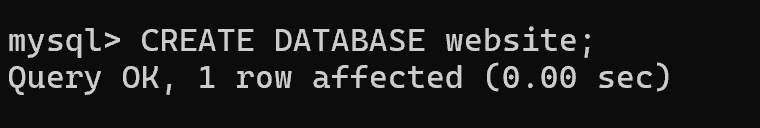
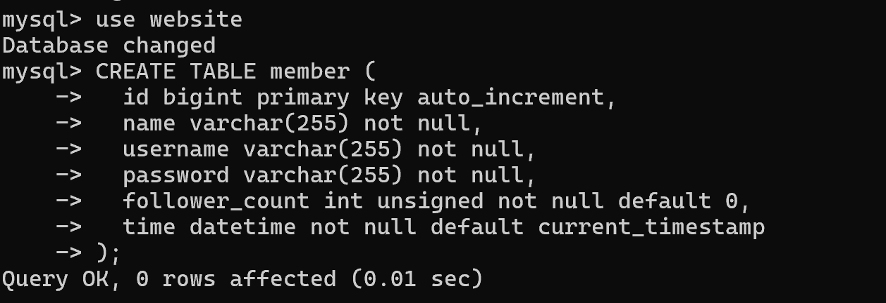

"# Task 2: Create database and table in your MySQL server" 
"Create a new database named website." 

"Create a new table named member, in the website database, designed as below:" 

"Task 3: SQL CRUD" 
