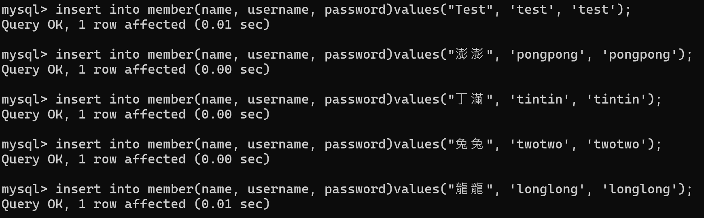
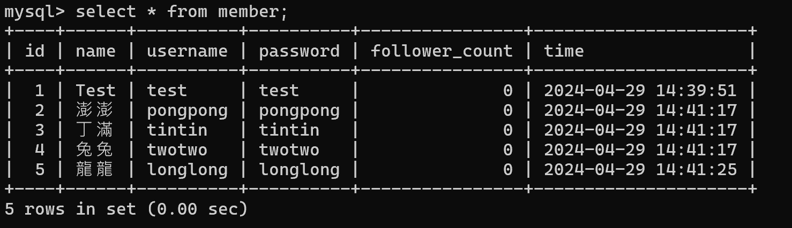
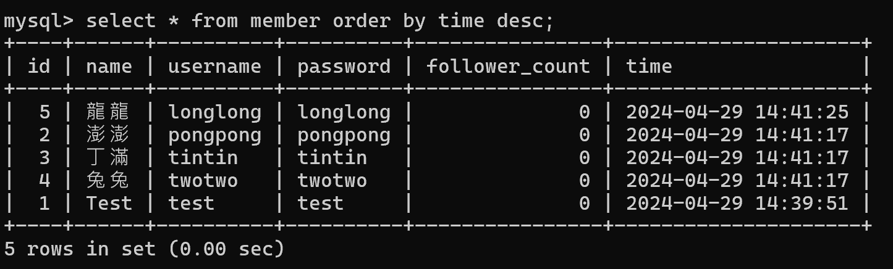
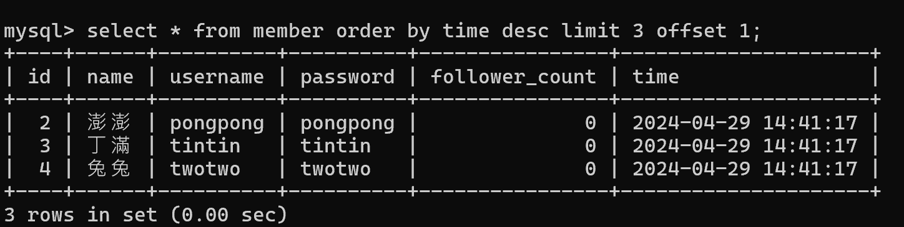
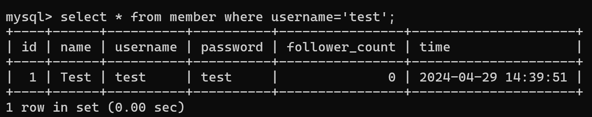
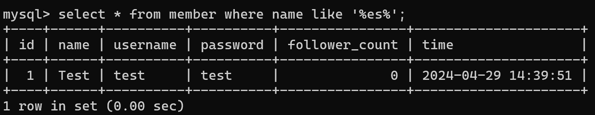
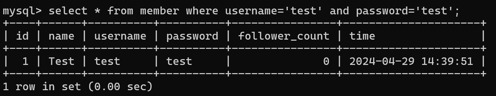
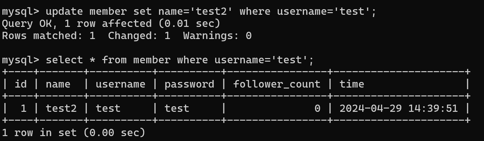

"# Task 2: Create database and table in your MySQL server" 
"Create a new database named website." 

"Create a new table named member, in the website database, designed as below:" 

"Task 3: SQL CRUD" 
"INSERT a new row to the member table where name, username and password mustbe set to test. INSERT additional 4 rows with arbitrary data." 

"SELECT all rows from the member table." 

"SELECT all rows from the member table, in descending order of time." 

"SELECT total 3 rows, second to fourth, from the member table, in descending order of time. Note: it does not mean SELECT rows where id are 2, 3, or 4." 

"SELECT rows where username equals to test." 

"SELECT rows where name includes the es keyword." 

"SELECT rows where both username and password equal to test." 

"UPDATE data in name column to test2 where username equals to test." 

